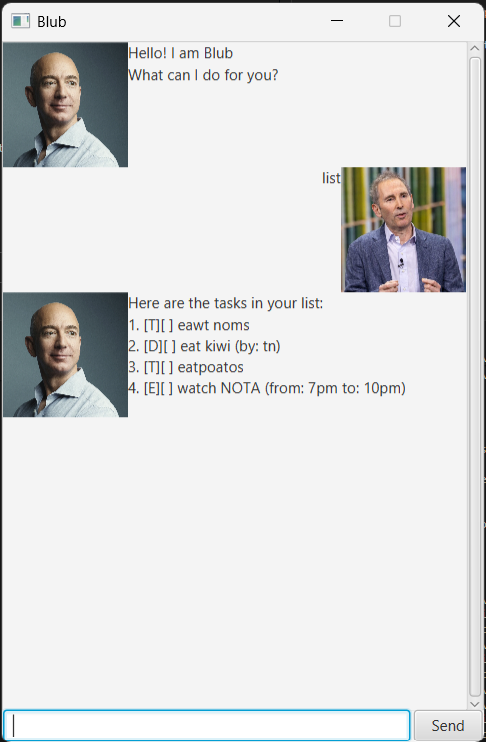

# Blub User Guide

Blub is a desktop task manager for tracking todos, deadlines, and events via a chat-style interface.



---

## Quick Start

1. Ensure Java 17 or above is installed.
2. Download the latest `blub.jar` from the releases page.
3. Run: `java -jar blub.jar`

---

## Task Types

Each task is displayed in the format: `[TYPE][STATUS] description`

| Symbol | Type     | Description                      |
|--------|----------|----------------------------------|
| `[T]`  | Todo     | A task with no date              |
| `[D]`  | Deadline | A task with a due date           |
| `[E]`  | Event    | A task with a start and end time |

Status: `[X]` = done, `[ ]` = not done.

---

## Commands

### `todo` — Add a Todo

```
todo <description>
```

- The description must not be empty.

Example: `todo Read a book`

Output:
```
Got it. I've added this task:
  [T][ ] Read a book
Now you have 1 tasks in the list.
```

---

### `deadline` — Add a Deadline

```
deadline <description> /by <date>
```

- The description must not be empty.
- The `/by` keyword (with a space on each side) is required.
- The date/time after `/by` must not be empty.
- If the date is in `yyyy-MM-dd` format (e.g. `2026-04-01`), it is automatically converted to a readable format (e.g. `Apr 01 2026`). Any other format is stored as-is without validation.

Example: `deadline Submit report /by 2026-04-01`

Output:
```
Got it. I've added this task:
  [D][ ] Submit report (by: Apr 01 2026)
Now you have 2 tasks in the list.
```

---

### `event` — Add an Event

```
event <description> /from <start> /to <end>
```

- The description must not be empty.
- Both `/from` and `/to` keywords (each with a space on each side) are required.
- The start and end times must not be empty.
- Start and end times are stored as free-form text — no date validation is performed.
- The `/from` segment must appear before `/to` in the command.

Example: `event Team meeting /from 2pm /to 3pm`

Output:
```
Got it. I've added this task:
  [E][ ] Team meeting (from: 2pm to: 3pm)
Now you have 3 tasks in the list.
```

---

### `list` — List All Tasks

```
list
```

Displays all tasks with their index, type, completion status, and details. The index shown here is used by `mark`, `delete`, and `edit`.

Output (example):
```
Here are the tasks in your list:
1. [T][ ] Read a book
2. [D][ ] Submit report (by: Apr 01 2026)
3. [E][ ] Team meeting (from: 2pm to: 3pm)
```

---

### `mark` — Mark a Task as Done

```
mark <index>
```

- The index must be a positive integer corresponding to a task shown in `list`.
- Tasks can only be marked as done — there is no unmark command.
- Marking an already-done task will not cause an error, but has no effect.

Example: `mark 2`

Output:
```
Nice! I've marked this task as done:
  [D][X] Submit report (by: Apr 01 2026)
```

---

### `delete` — Delete a Task

```
delete <index>
```

- The index must be a positive integer corresponding to a task shown in `list`.
- Deletion is permanent and cannot be undone.
- After deletion, the indices of all subsequent tasks shift down by one.

Example: `delete 3`

Output:
```
Noted. I've removed this task:
  [E][ ] Team meeting (from: 2pm to: 3pm)
Now you have 2 tasks in the list.
```

---

### `edit` — Edit a Task

```
edit <index>
```

- The index must be a positive integer corresponding to a task shown in `list`.
- This command **deletes** the task immediately and pre-fills the input box with its original command string, ready for you to modify and resubmit.
- If you close the app or submit a different command without resubmitting the edit, the task is lost — there is no automatic undo.
- The pre-filled command uses the stored (possibly reformatted) date. For example, a deadline originally entered as `2026-04-01` will be pre-filled as `Apr 01 2026`, not in the original format.

Example: `edit 1`

Output:
```
Editing task:
  [T][ ] Read a book
I've removed it. Edit the command below and submit to re-create it.
```
The input box is then pre-filled with: `todo Read a book`

---

### `find` — Find Tasks by Keyword

```
find <keyword>
```

- The keyword must not be empty.
- Matching is case-sensitive and checks if the task description **contains** the keyword as a substring.
- The indices shown in `find` results are for display only — use `list` to get the correct indices for `mark`, `delete`, or `edit`.

Example: `find report`

Output:
```
Here are the matching tasks in your list:
1. [D][ ] Submit report (by: Apr 01 2026)
```

---

### `bye` — Exit

```
bye
```

- Saves all current tasks to `data/tasks.txt` and closes the application.
- If saving fails, an error message is shown and the app remains open.

---

## Data Storage

- Tasks are saved to `data/tasks.txt` (relative to where the jar is run) only when you exit with `bye`.
- The file is loaded automatically on the next launch. If the file is missing or unreadable, Blub starts with an empty task list.
- Do not manually edit `data/tasks.txt` — a corrupted format may cause tasks to load incorrectly.
